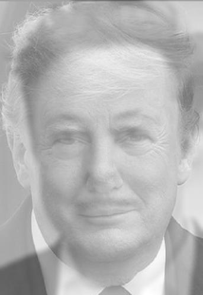

# Hybrid Image Creator

This project demonstrates how to create a hybrid image using MATLAB. Hybrid images combine the low-frequency components of one image with the high-frequency components of another.

## Features
- Low-pass and high-pass filtering of images.
- Combination of two images into a hybrid image.
- Save and display the output hybrid image.

## Getting Started

### Prerequisites
- MATLAB installed on your system.

### Input
Place your two input images in the `images` folder:
- `IMG_3644.jpg` (First image, e.g., Donald Trump)
- `IMG_3645.jpg` (Second image, e.g., Elon Musk)

### How to Run
1. Open the `hybrid_image.m` file in MATLAB.
2. Ensure the input images are available in the `images` folder.
3. Run the script.
4. The output image will be saved in the `output` folder as `hybrid_image.jpg`.

## Output
An example of the output hybrid image:

## Code Structure
- **images/**: Folder containing input images.
- **output/**: Folder for the output hybrid image.
- **src/**: Folder containing the MATLAB script.
- **README.md**: Documentation for the project.

## License
This project is licensed under the MIT License - see the `LICENSE` file for details.
